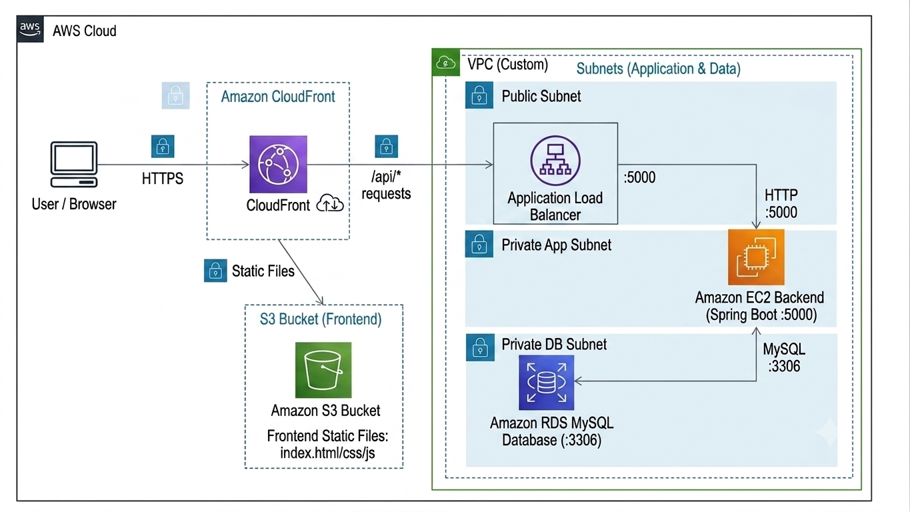

# URL Shortener

URL을 짧게 만들어주는 간단한 웹 애플리케이션으로, Spring Boot와 MySQL로 개발함
로컬 실행은 Docker Compose로, AWS 배포 구조는 Terraform으로 구성해보는 데 중점을 둠

## Architecture



3-tier 구조를 기준으로 구성함

```text
CloudFront + S3        -> frontend 정적 파일
ALB + Private EC2      -> Spring Boot backend
Private RDS MySQL      -> database
```

## AWS 구성 흐름

- User는 CloudFront를 통해 S3에 저장된 frontend 정적 파일을 받음
- Frontend에서 발생한 API 요청은 ALB로 전달
- ALB는 요청을 private subnet의 EC2로 전달
- EC2에서는 Spring Boot backend가 `5000` 포트로 실행
- Backend는 private DB subnet의 RDS MySQL과 통신
- RDS는 EC2 security group에서 오는 `3306` 요청만 허용
- EC2 접속은 public SSH 대신 SSM을 사용
- CloudWatch alarm으로 EC2, RDS, ALB 상태를 기본 모니터링

## Tech Stack

| 구분 | 사용 기술 |
|------|-----------|
| Frontend | HTML, CSS, JavaScript, Nginx |
| Backend | Java, Spring Boot |
| Database | MySQL |
| Local | Docker Compose |
| Infra | Terraform |
| AWS | VPC, S3, CloudFront, ALB, EC2, RDS, SSM, CloudWatch |

## 주요 기능

- 긴 URL 단축 (랜덤 or 직접 설정)
- 단축 URL로 원본 URL 리다이렉트
- 저장된 URL 목록 조회
- 클릭 수 확인
- URL 삭제

## API

| Method | Endpoint | 설명 |
|--------|----------|------|
| POST | `/api/shorten` | URL 단축 |
| GET | `/s/{shortCode}` | 원본 URL로 리다이렉트 |
| GET | `/api/urls` | URL 목록 조회 |
| GET | `/api/stats/{shortCode}` | URL 통계 조회 |
| DELETE | `/api/urls/{id}` | URL 삭제 |

## Local 실행

```powershell
docker compose -f infra/docker-compose.yml up -d --build
```

접속 주소

```text
Frontend: http://localhost:3000
Backend:  http://localhost:5000
MySQL:    localhost:3306
```

중지

```powershell
docker compose -f infra/docker-compose.yml down
```

## Terraform 실행

Terraform 실행

```powershell
cd infra/Terraform
terraform init
terraform plan
terraform apply
```

리소스 삭제

```powershell
terraform destroy
```

## 프로젝트 구조

```text
URL_Shortener/
  backend/
    Dockerfile
    pom.xml
    src/
  frontend/
    Dockerfile
    index.html
    nginx.conf
    script.js
    style.css
  infra/
    docker-compose.yml
    Terraform/
      providers.tf
      variables.tf
      main.tf
      vpc.tf
      security_groups.tf
      load_balancer.tf
      compute.tf
      iam_role.tf
      vpc_endpoint.tf
      database.tf
      frontend.tf
      monitoring.tf
      outputs.tf
  image/
    Architecture.png
```

## Terraform (.tf) 파일

| 파일 | 내용 |
|------|------|
| `providers.tf` | AWS provider 설정 |
| `variables.tf` | 입력 변수 |
| `main.tf` | 공통 locals, tags |
| `vpc.tf` | VPC, subnet, routing |
| `security_groups.tf` | 보안 그룹 |
| `load_balancer.tf` | ALB, target group, listener |
| `compute.tf` | EC2 backend server |
| `iam_role.tf` | EC2 SSM 접근용 IAM role |
| `vpc_endpoint.tf` | SSM VPC endpoint |
| `database.tf` | RDS MySQL |
| `frontend.tf` | S3, CloudFront |
| `monitoring.tf` | CloudWatch alarm |
| `outputs.tf` | 배포 후 출력값 |

