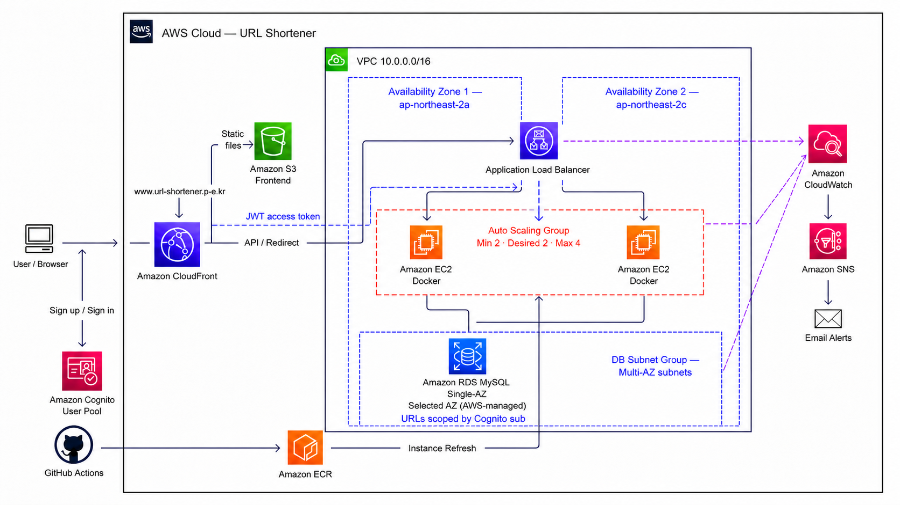
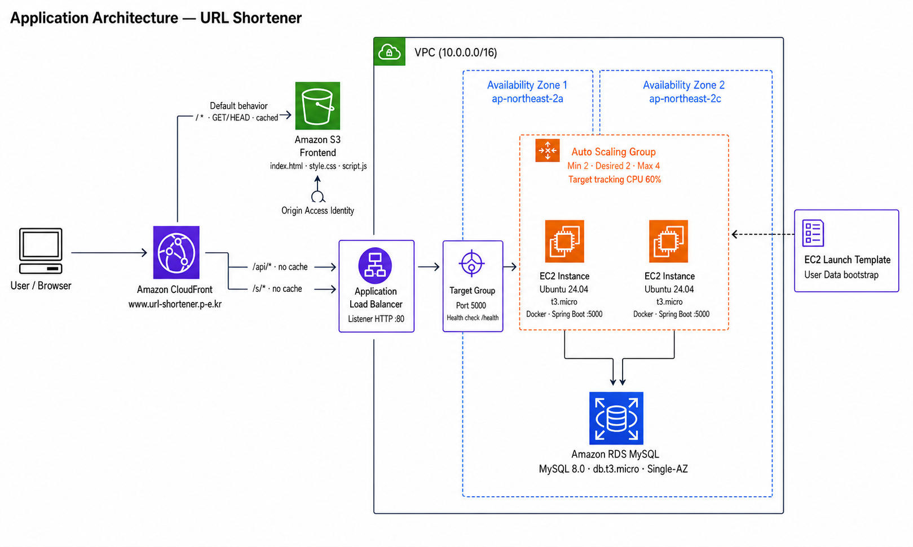
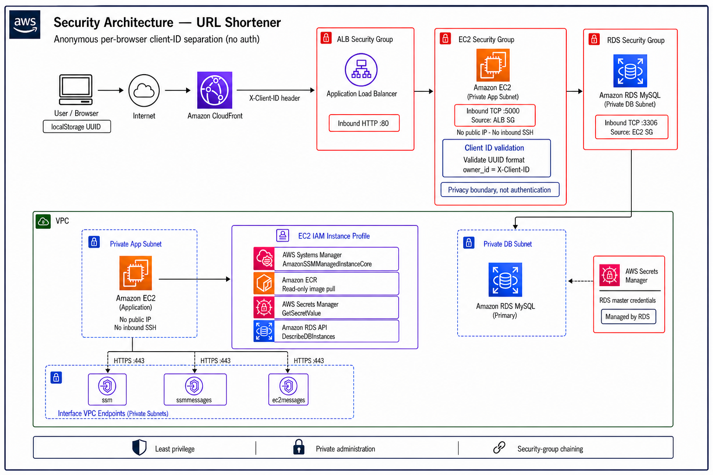
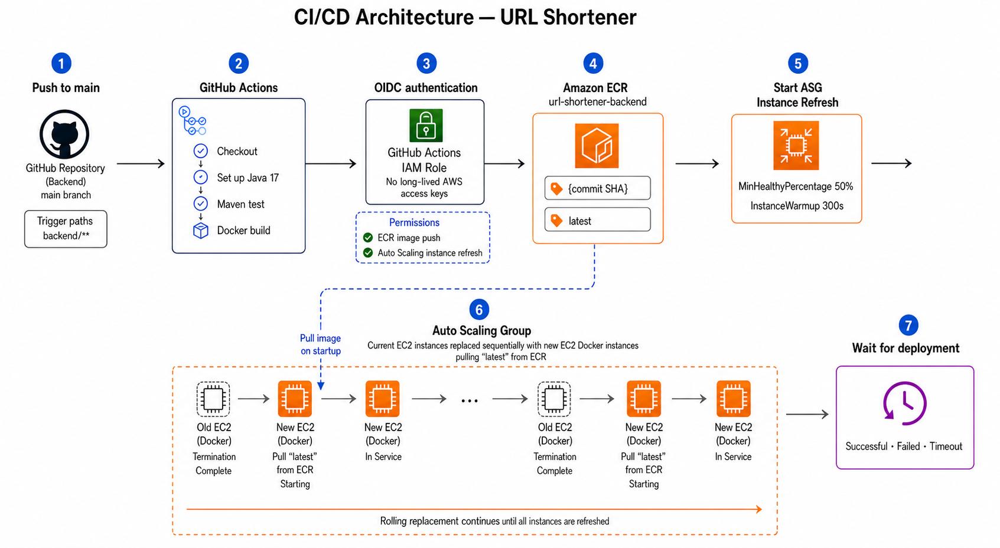
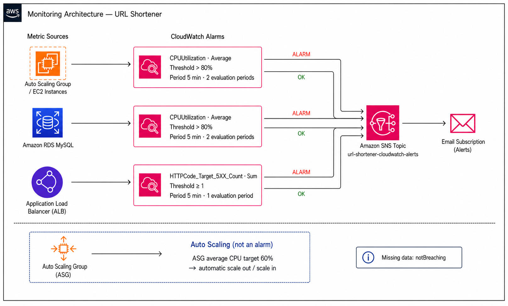

# URL Shortener

긴 URL을 짧고 관리하기 쉬운 링크로 변환하는 URL 단축 서비스입니다.

Spring Boot와 MySQL로 URL 매핑 및 클릭 통계를 관리하며, Amazon Cognito와 Spring Security JWT 인증으로 사용자별 URL 목록을 분리합니다. 로컬 환경은 Docker Compose로 실행하고, AWS 환경은 Terraform으로 구성하며 CloudFront, S3, ALB, EC2, RDS를 이용한 3-tier 아키텍처를 사용합니다.

## 기능

- 랜덤 단축 코드 생성
- 사용자 지정 단축 코드 생성
- 단축 URL을 통한 원본 URL 리다이렉트
- 생성한 URL 목록 및 클릭 횟수 조회
- 단축 URL 복사 버튼
- 저장된 URL 삭제
- Amazon Cognito 회원가입 및 로그인
- 로그인 사용자별 URL 목록·통계·삭제 권한 분리
- GitHub Actions와 Amazon ECR을 이용한 백엔드 자동 배포
- Auto Scaling Group을 이용한 확장 및 무중단 롤링 배포
- CloudWatch와 SNS를 이용한 EC2, RDS, ALB 모니터링 및 이메일 알림

## 아키텍처

### 전체 구성



사용자가 `www.url-shortener.p-e.kr`로 접속하면 S3에서 제공하는 프론트엔드가 Amazon Cognito Managed Login으로 회원가입과 로그인을 처리합니다. 로그인에 성공하면 브라우저가 JWT 액세스 토큰을 발급받습니다. CloudFront는 요청 경로에 따라 트래픽을 구분하며 HTML, CSS, JavaScript와 Cognito 설정 파일은 S3에서 제공합니다. JWT가 필요한 `/api/*` 요청과 공개 리다이렉트 경로인 `/s/*` 요청은 ALB로 전달합니다.

ALB는 `/health` 상태 검사를 통과한 EC2 인스턴스에 요청을 분산하며, 각 EC2는 시작될 때 ECR에서 최신 Docker 이미지를 가져와 Spring Boot 애플리케이션을 컨테이너로 실행합니다. Spring Security는 Cognito JWT의 서명, 발급자와 만료 시간을 검증하고 `sub` 클레임을 사용자 식별자로 사용합니다. 생성된 단축 URL과 원본 URL 매핑 정보, 클릭 횟수 및 소유자 ID는 RDS MySQL에 저장합니다.

CloudWatch는 EC2와 RDS의 CPU 사용률, ALB에서 발생한 HTTP 5xx 오류를 모니터링합니다. 설정한 임계값을 초과하거나 다시 정상 상태로 돌아오면 CloudWatch Alarm이 동작하고, SNS를 통해 등록된 이메일로 알림을 보냅니다.

### 애플리케이션 요청 흐름



`www.url-shortener.p-e.kr` 도메인은 외부 DNS의 CNAME 레코드를 이용해 CloudFront 배포 도메인과 연결했습니다. HTTPS 인증서는 CloudFront에서 사용할 수 있도록 `us-east-1` 리전의 ACM을 통해 발급했습니다.

CloudFront는 요청 경로에 따라 Origin을 구분합니다. 기본 경로의 `index.html`, `style.css`, `script.js`, `config.js`는 S3에서 제공하고, `/api/*`와 `/s/*` 요청은 ALB로 전달합니다. `/api/*` 요청에는 Cognito JWT가 `Authorization: Bearer` 헤더로 포함되며 CloudFront가 이 헤더를 ALB와 백엔드까지 전달합니다. API 응답과 리다이렉트 결과가 캐시에 남지 않도록 두 경로의 TTL을 `0`으로 설정했습니다.

ALB는 요청을 Target Group에 등록된 EC2 인스턴스의 `5000` 포트로 전달합니다. Target Group은 `/health` 경로를 통해 각 인스턴스의 상태를 확인하며, 상태가 `healthy`인 인스턴스에만 요청을 분산합니다. `/health`와 `/s/*`는 공개하고, URL 생성·목록·통계·삭제에 사용하는 `/api/*`는 인증된 사용자에게만 허용합니다. 백엔드는 JWT의 `sub`와 DB의 `owner_id`가 일치하는 URL만 조회하거나 변경합니다.

### 네트워크 구성


VPC는 `10.0.0.0/16` 대역을 사용하며, `ap-northeast-2a`와 `ap-northeast-2c` 두 가용 영역에 걸쳐 구성했습니다. 각 가용 영역에는 Public Subnet, Private App Subnet, Private DB Subnet을 하나씩 배치했습니다.

VPC에는 Internet Gateway를 연결하고, Public Subnet의 기본 경로(`0.0.0.0/0`)가 Internet Gateway를 향하도록 설정했습니다. 인터넷과 통신해야 하는 ALB와 NAT Gateway는 Public Subnet에 배치했고, 외부에서 직접 접근할 필요가 없는 백엔드 EC2와 RDS는 Private Subnet에 배치했습니다.

### 백엔드와 Auto Scaling

백엔드는 EC2의 Docker 컨테이너에서 실행합니다. Launch Template은 Ubuntu 24.04와 `t3.micro`를 사용하며, 인스턴스가 시작되면 User Data를 통해 Docker와 AWS CLI를 설치합니다. 이후 ECR에서 `latest` 태그가 붙은 백엔드 이미지를 내려받아 Spring Boot 컨테이너를 실행합니다.

Auto Scaling Group은 EC2를 두 가용 영역에 나눠 배치하며, 기본적으로 2대를 유지합니다. 평균 CPU 사용률 `60%`를 기준으로 인스턴스를 최소 2대에서 최대 4개까지 인스턴스를 자동으로 늘리거나 줄입니다. 새 버전을 배포할 때는 Instance Refresh로 기존 인스턴스를 새 이미지가 적용된 인스턴스로 차례대로 교체합니다.

### 데이터베이스와 자격 증명

데이터베이스는 RDS MySQL 8.0을 사용하며, `db.t3.micro`, 20GB의 Single-AZ 구성하여 운영합니다. DB Subnet Group에는 두 가용 영역의 Private DB Subnet을 등록했고, 자동 백업의 보관 기간은 1일로 설정했습니다.

마스터 비밀번호는 코드나 User Data에 직접 저장하지 않고, RDS가 관리하는 Secrets Manager에 보관합니다. EC2는 IAM Role을 통해 RDS 엔드포인트와 Secrets Manager의 비밀번호를 조회한 뒤, 해당 값을 컨테이너 환경 변수로 전달해 데이터베이스에 연결합니다.

### 접근 제어와 보안



Security Group은 `ALB:80 → EC2:5000 → RDS:3306` 경로에 필요한 통신만 허용했습니다. EC2는 공인 IP와 SSH 포트 없이 Private App Subnet에 배치하고, 서버 관리는 SSH 대신 Session Manager를 사용합니다. 외부 인터넷을 거치지 않고 접속할 수 있도록 두 Private App Subnet에 SSM 관련 VPC Endpoint도 구성했습니다.

S3 버킷은 외부에 공개하지 않고, CloudFront OAI를 통해서만 정적 파일을 읽을 수 있도록 설정했습니다.

사용자 인증은 VPC 외부의 Amazon Cognito User Pool이 담당합니다. 프론트엔드는 Authorization Code와 PKCE 방식으로 로그인하고 액세스 토큰을 메모리에 가까운 `sessionStorage`에 보관합니다. 백엔드는 요청 본문에서 사용자 ID를 받지 않고 검증된 JWT의 `sub`를 직접 사용하므로 다른 사용자의 ID를 임의로 지정할 수 없습니다.

### CI/CD 배포 흐름



`main` 브랜치의 백엔드 코드가 변경되면 GitHub Actions가 Maven 테스트를 실행하고 Docker 이미지를 빌드합니다. AWS 인증에는 고정 Access Key 대신 GitHub OIDC를 사용해 필요한 IAM Role을 일시적으로 부여받습니다.

빌드한 이미지는 커밋 SHA와 `latest` 태그를 붙여 ECR에 업로드합니다. 업로드가 완료되면 ASG Instance Refresh를 실행해 기존 EC2를 새 이미지가 적용된 인스턴스로 순차 교체합니다. GitHub Actions는 Instance Refresh가 완료될 때까지 상태를 확인하고, 교체 실패나 시간 초과가 발생하면 배포를 실패로 처리합니다.

### 모니터링과 알림



CloudWatch는 EC2와 RDS의 CPU 사용률, ALB Target에서 발생한 HTTP 5xx 오류를 모니터링합니다. 경보가 발생하거나 다시 정상 상태로 돌아오면 SNS를 통해 등록된 이메일로 알림을 보냅니다.

- EC2 평균 CPU 사용률이 5분 주기로 2회 연속 80% 초과
- RDS 평균 CPU 사용률이 5분 주기로 2회 연속 80% 초과
- 5분 동안 발생한 ALB Target의 HTTP 5xx 응답 합계가 1 이상

Auto Scaling은 CloudWatch 경보와 별도로 동작합니다. ASG의 평균 CPU 사용률이 `60%`를 유지하도록 EC2 인스턴스 수를 최소 2대에서 최대 4대까지 자동으로 조절합니다.

## 사용 기술

### Application


### Infrastructure


- AWS: VPC, CloudFront, ACM, Cognito, S3, ALB, EC2 Auto Scaling, ECR, RDS, IAM, Systems Manager, Secrets Manager, CloudWatch, SNS
- CI/CD: GitHub Actions, AWS OIDC, EC2 Instance Refresh
- Local: Docker Compose

## API

| Method | Endpoint | 인증 | 설명 |
|---|---|---|---|
| `POST` | `/api/shorten` | 필요 | 로그인 사용자의 단축 URL 생성 |
| `GET` | `/s/{shortCode}` | 불필요 | 원본 URL로 리다이렉트하고 클릭 수 증가 |
| `GET` | `/api/urls` | 필요 | 로그인 사용자가 생성한 URL 목록 조회 |
| `GET` | `/api/stats/{shortCode}` | 필요 | 본인 URL의 생성 시각과 클릭 수 조회 |
| `DELETE` | `/api/urls/{id}` | 필요 | 본인이 저장한 URL 삭제 |

단축 URL 생성 요청 예시

```json
{
  "url": "https://example.com/very/long/url",
  "custom_code": "my-link"
}
```

`custom_code`는 생략할 수 있습니다.

## 로컬 실행

### 사전 요구 사항

- Docker
- Docker Compose

`infra/.env` 파일을 생성합니다.

```env
MYSQL_ROOT_PASSWORD=change_me
DB_PASSWORD=change_me
```

프로젝트 루트에서 실행합니다.

```powershell
docker compose --env-file infra/.env -f infra/docker-compose.yml up -d --build
```

접속 주소

```text
Frontend: http://localhost:3000
Backend:  http://localhost:5000
MySQL:    localhost:3306
```

상태 및 로그 확인

```powershell
docker compose --env-file infra/.env -f infra/docker-compose.yml ps
docker compose --env-file infra/.env -f infra/docker-compose.yml logs -f
```

종료

```powershell
docker compose --env-file infra/.env -f infra/docker-compose.yml down
```

MySQL 데이터 볼륨까지 삭제하려면 `down -v`를 사용합니다.

## AWS 배포

### 사전 요구 사항

- AWS CLI 인증
- Terraform
- Docker
- 대상 AWS 계정에서 리소스를 생성할 권한

아래 명령은 WSL Bash를 기준으로 작성했습니다. Terraform 디렉터리로 이동합니다.

```bash
cd infra/Terraform
```

알림을 받을 이메일 주소를 사용해 `terraform.tfvars`를 생성합니다. `region`, `github_repository`, `github_branch`는 기본값을 변경할 때만 지정하면 됩니다.

```hcl
alarm_email      = "your-email@example.com"
region           = "ap-northeast-2"
github_repository = "lty02-ops/URL_Shortener"
github_branch     = "main"
```

RDS 마스터 비밀번호는 AWS가 관리하며 Secrets Manager에 저장됩니다. `terraform.tfvars`에는 배포 환경 정보가 포함될 수 있으므로 Git에 커밋하지 않습니다.

### 최초 배포

처음 배포할 때는 CloudFront에서 사용할 ACM 인증서를 검증하고, EC2가 실행할 첫 Docker 이미지를 ECR에 올려야 합니다.

먼저 Terraform을 초기화하고 구성을 검증합니다.

```bash
terraform init
terraform fmt -check
terraform validate
```

DNS 검증에 사용할 ACM 인증서와 Docker 이미지를 저장할 ECR Repository를 먼저 생성합니다.

```bash
terraform apply \
  -target=aws_acm_certificate.cloudfront \
  -target=aws_ecr_repository.backend
```

`-target`은 최초 배포 준비 단계에서만 사용합니다. 출력된 CNAME 레코드를 외부 DNS 관리 페이지에 등록해 ACM 인증서를 검증합니다.

```bash
terraform output certificate_validation_records
```

인증서 상태를 확인합니다.

```bash
certificate_arn=$(terraform output -raw cloudfront_certificate_arn)

aws acm describe-certificate \
  --certificate-arn "$certificate_arn" \
  --region us-east-1 \
  --query 'Certificate.Status' \
  --output text
```

결과가 `ISSUED`가 되면 최초 백엔드 이미지를 ECR에 업로드합니다.

```bash
ecr_repo_uri=$(terraform output -raw ecr_repository_url)
ecr_registry=${ecr_repo_uri%%/*}

aws ecr get-login-password --region ap-northeast-2 \
  | docker login --username AWS --password-stdin "$ecr_registry"

docker build \
  --platform linux/amd64 \
  -t "$ecr_repo_uri:latest" \
  ../../backend

docker push "$ecr_repo_uri:latest"
```

이미지 업로드가 끝나면 전체 인프라를 배포합니다.

```bash
terraform plan
terraform apply
```

배포 후 `cloudfront_domain_name`을 확인하고, 외부 DNS에 `www` CNAME 레코드로 등록합니다. SNS에서 보낸 구독 확인 이메일도 승인해야 CloudWatch 알림을 받을 수 있습니다.

```bash
terraform output -raw cloudfront_domain_name
```

### 이후 전체 인프라 배포

ACM 인증서 검증과 최초 이미지 업로드가 끝난 이후에는 일반적인 Terraform 절차로 변경 사항을 적용합니다.

```bash
terraform init
terraform fmt -check
terraform validate
terraform plan
terraform apply
```

배포 결과를 확인합니다.

```powershell
terraform output
```

주요 출력값

- `cloudfront_domain_name`: 서비스 접속 도메인
- `cloudfront_distribution_id`: CloudFront 캐시 무효화에 사용하는 배포 ID
- `cognito_user_pool_id`: 사용자 계정을 관리하는 Cognito User Pool ID
- `cognito_client_id`: 프론트엔드 OAuth 클라이언트 ID
- `cognito_login_url`: Cognito Managed Login 도메인
- `alb_dns_name`: 백엔드 ALB 도메인
- `db_endpoint`: RDS 접속 엔드포인트
- `autoscaling_group_name`: 백엔드 Auto Scaling Group 이름
- `launch_template_id`: 백엔드 EC2 Launch Template ID
- `ecr_repository_url`: 백엔드 Docker 이미지를 저장할 ECR 주소
- `github_actions_role_arn`: GitHub Actions가 OIDC로 사용할 IAM Role ARN
- `certificate_validation_records`: ACM 인증서 검증에 필요한 DNS 레코드
- `cloudfront_certificate_arn`: CloudFront에 연결되는 ACM 인증서 ARN

### 백엔드 자동 배포

Terraform 적용 후 출력된 IAM Role ARN을 GitHub 저장소의 Actions secret으로 등록합니다.

```bash
terraform output -raw github_actions_role_arn
```

GitHub 저장소의 `Settings > Secrets and variables > Actions`에서 다음 secret을 생성합니다.

```text
AWS_GITHUB_ACTIONS_ROLE_ARN=<github_actions_role_arn 출력값>
```

`main` 브랜치의 `backend/**` 또는 백엔드 배포 워크플로가 변경되면 GitHub Actions가 다음 작업을 수행합니다.

1. Java 17과 Maven으로 백엔드 테스트 실행
2. Docker 이미지 빌드
3. 커밋 SHA와 `latest` 태그로 Amazon ECR에 이미지 푸시
4. Auto Scaling Group Instance Refresh 시작
5. 롤링 배포가 완료될 때까지 상태 확인

EC2 인스턴스는 Launch Template의 User Data를 통해 시작 시 ECR의 `latest` 이미지를 내려받습니다. RDS 접속 정보와 관리형 마스터 비밀번호는 RDS 및 Secrets Manager에서 조회한 후 컨테이너 환경 변수로 전달합니다. 따라서 EC2에 직접 접속해 백엔드를 설치할 필요가 없습니다.

리소스 삭제

```powershell
terraform destroy
```

## Troubleshooting

### RDS Free Tier 제한으로 Terraform 적용 실패

RDS의 자동 백업 보관 기간을 Free Tier에서 허용하는 범위보다 길게 설정해 `terraform apply`가 실패했습니다. 계정 제한에 맞춰 `backup_retention_period`를 1일로 변경했습니다.

### ECR 이미지 업데이트 후 기존 EC2에 반영되지 않음

새 이미지를 ECR에 올려도 실행 중인 EC2 컨테이너는 자동으로 바뀌지 않았습니다. 이미지 업로드 후 ASG Instance Refresh를 실행하도록 GitHub Actions를 구성하고, Refresh가 완료되거나 실패할 때까지 상태를 확인하도록 했습니다.

### 배포 중 ALB Target 상태 확인

Instance Refresh 중 새 EC2가 상태 검사를 통과하지 못하면 기존 인스턴스 교체가 지연될 수 있었습니다. 애플리케이션의 `/health` 경로를 Target Group 상태 검사에 사용하고, ALB Target 상태와 Instance Refresh 진행 상태를 함께 확인하도록 했습니다.

## 현재 제약 사항

- 비용을 고려해 RDS를 Single-AZ로 구성했습니다. 데이터베이스가 위치한 가용 영역에 장애가 발생하면 다른 가용 영역으로 자동 전환되지 않습니다.
- 사용 중인 AWS 계정의 Free Tier 제한으로 RDS 자동 백업 보관 기간을 1일로 설정했습니다.
- 외부 DNS 서비스를 사용하므로 ACM 인증서 검증 레코드와 CloudFront CNAME 레코드를 직접 등록해야 합니다.
- 프론트엔드는 Terraform으로 S3 객체를 관리하고 있어 백엔드처럼 GitHub Actions를 통한 자동 배포는 지원하지 않습니다.

## 개발자

- GitHub: [lty02-ops](https://github.com/lty02-ops)
