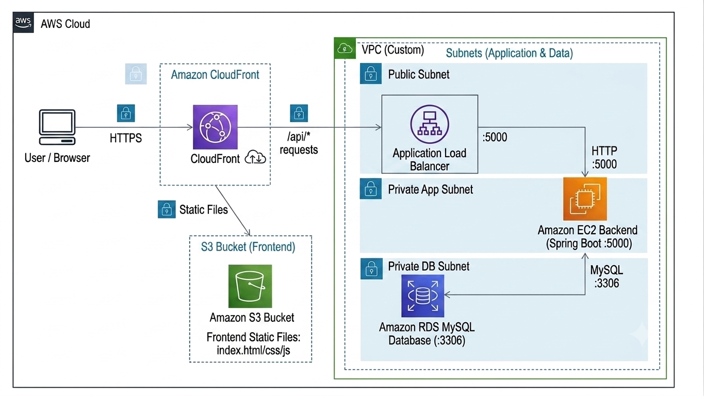

# URL Shortener

긴 URL을 짧고 관리하기 쉬운 링크로 변환하는 URL 단축 서비스입니다.

Spring Boot와 MySQL로 URL 매핑 및 클릭 통계를 관리하며, 로컬 환경은 Docker Compose로 실행합니다. AWS 환경은 Terraform으로 구성하며 CloudFront, S3, ALB, EC2, RDS를 이용한 3-tier 아키텍처를 사용합니다.

## 기능

- 랜덤 단축 코드 생성
- 사용자 지정 단축 코드 생성
- 단축 URL을 통한 원본 URL 리다이렉트
- 생성한 URL 목록 및 클릭 횟수 조회
- 단축 URL 복사 버튼
- 저장된 URL 삭제
- CloudWatch를 이용한 EC2, RDS, ALB 모니터링

## 아키텍처

### 전체 구성




CloudFront가 서비스의 진입점 역할을 합니다. HTML, CSS, JavaScript 같은 정적 파일은 S3에서 제공하고, API 요청과 단축 URL 리다이렉트 요청은 ALB를 거쳐 Spring Boot 애플리케이션으로 전달합니다.

### 네트워크와 보안

- ALB는 인터넷 요청을 받고 EC2의 `5000` 포트로 전달합니다.
- Spring Boot 애플리케이션은 RDS MySQL과 `3306` 포트로 통신합니다.
- RDS는 EC2 보안 그룹에서 오는 데이터베이스 요청만 허용합니다.
- EC2 관리는 공개 SSH 대신 AWS Systems Manager Session Manager를 사용합니다.
- SSM, EC2 Messages, SSM Messages용 VPC Endpoint를 구성합니다.
- S3 정적 파일은 CloudFront Origin Access Identity를 통해서만 조회합니다.

### 모니터링

CloudWatch Alarm으로 다음 항목을 감시합니다.

- EC2 평균 CPU 사용률 80% 초과
- RDS 평균 CPU 사용률 80% 초과
- ALB 대상에서 발생한 HTTP 5xx 응답

## 사용 기술

### Application


### Infrastructure


- AWS: VPC, CloudFront, S3, ALB, EC2, RDS, IAM, Systems Manager, CloudWatch
- Local: Docker Compose

## API

| Method | Endpoint | 설명 |
|---|---|---|
| `POST` | `/api/shorten` | 랜덤 또는 사용자 지정 코드로 단축 URL 생성 |
| `GET` | `/s/{shortCode}` | 원본 URL로 리다이렉트하고 클릭 수 증가 |
| `GET` | `/api/urls` | 생성된 URL 목록 조회 |
| `GET` | `/api/stats/{shortCode}` | 생성 시각과 클릭 수 조회 |
| `DELETE` | `/api/urls/{id}` | 저장된 URL 삭제 |

단축 URL 생성 요청 예시:

```json
{
  "url": "https://example.com/very/long/url",
  "custom_code": "my-link"
}
```

`custom_code`는 생략할 수 있습니다.

## 로컬 실행

### 사전 요구 사항

- Docker
- Docker Compose

`infra/.env` 파일을 생성합니다.

```env
MYSQL_ROOT_PASSWORD=change_me
DB_PASSWORD=change_me
```

프로젝트 루트에서 실행합니다.

```powershell
docker compose --env-file infra/.env -f infra/docker-compose.yml up -d --build
```

접속 주소:

```text
Frontend: http://localhost:3000
Backend:  http://localhost:5000
MySQL:    localhost:3306
```

상태 및 로그 확인:

```powershell
docker compose --env-file infra/.env -f infra/docker-compose.yml ps
docker compose --env-file infra/.env -f infra/docker-compose.yml logs -f
```

종료:

```powershell
docker compose --env-file infra/.env -f infra/docker-compose.yml down
```

MySQL 데이터 볼륨까지 삭제하려면 `down -v`를 사용합니다.

## AWS 배포

### 사전 요구 사항

- AWS CLI 인증
- Terraform
- 대상 AWS 계정에서 리소스를 생성할 권한

Terraform 디렉터리로 이동합니다.

```powershell
cd infra/Terraform
```

다음 형식으로 `terraform.tfvars`를 생성합니다.

```hcl
region      = "ap-northeast-2"
db_password = "change_me"
```

`terraform.tfvars`에는 데이터베이스 비밀번호가 포함되므로 Git에 커밋하지 않습니다.

인프라를 검증하고 배포합니다.

```powershell
terraform init
terraform fmt -check
terraform validate
terraform plan
terraform apply
```

배포 결과를 확인합니다.

```powershell
terraform output
```

주요 출력값:

- `cloudfront_domain_name`: 서비스 접속 도메인
- `alb_dns_name`: 백엔드 ALB 도메인
- `db_endpoint`: RDS 접속 엔드포인트
- `instance_id`: 백엔드 EC2 인스턴스 ID

Terraform은 AWS 인프라와 S3 정적 파일을 생성하지만 Spring Boot 애플리케이션을 EC2에 설치하고 실행하는 과정은 자동화하지 않습니다. EC2에 백엔드를 별도로 배포하고 다음 RDS 접속 정보를 환경 변수로 설정해야 합니다.

```env
DB_HOST=<RDS endpoint>
DB_NAME=urlshortenerdb
DB_USER=URLShortener
DB_PASSWORD=<database password>
```

리소스 삭제:

```powershell
terraform destroy
```

## 현재 제약 사항

- Terraform은 EC2를 생성하지만 백엔드 빌드 및 배포는 자동화하지 않았기 때문에 별도로 EC2에 접속해서 백엔드를 배포해야합니다.
- RDS는 단일 인스턴스로 구성되어 Multi-AZ 장애를 대처하지 못합니다.
- 로그인 기능이 없어 사용자 인증과 URL 소유권 구분이 안되기 때문에 모든 사용자가 같은 URL 목록을 조회하고 삭제할 수 있습니다.

## 개발자

- GitHub: [lty02-ops](https://github.com/lty02-ops)
