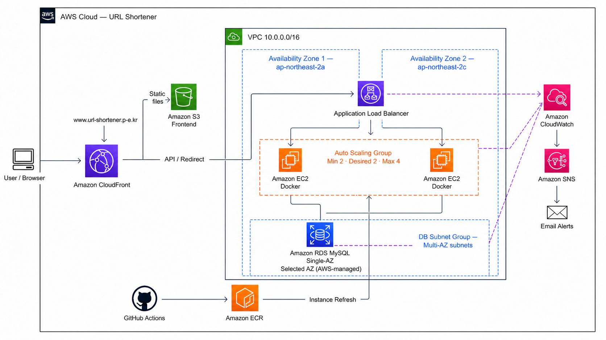
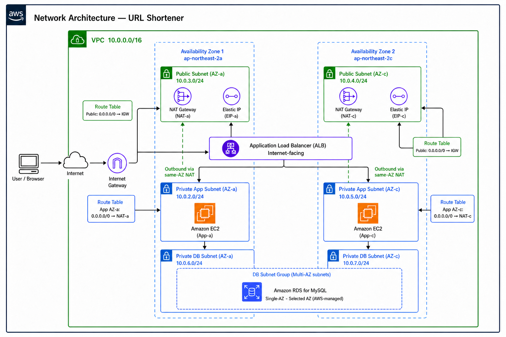

# URL Shortener

긴 URL을 짧고 관리하기 쉬운 링크로 변환하는 URL 단축 서비스입니다.

Spring Boot와 MySQL로 URL 매핑 및 클릭 통계를 관리하며, 로컬 환경은 Docker Compose로 실행합니다. AWS 환경은 Terraform으로 구성하며 CloudFront, S3, ALB, EC2, RDS를 이용한 3-tier 아키텍처를 사용합니다.

## 기능

- 랜덤 단축 코드 생성
- 사용자 지정 단축 코드 생성
- 단축 URL을 통한 원본 URL 리다이렉트
- 생성한 URL 목록 및 클릭 횟수 조회
- 단축 URL 복사 버튼
- 저장된 URL 삭제
- GitHub Actions와 Amazon ECR을 이용한 백엔드 자동 배포
- Auto Scaling Group을 이용한 확장 및 무중단 롤링 배포
- CloudWatch와 SNS를 이용한 EC2, RDS, ALB 모니터링 및 이메일 알림

## 아키텍처

### 전체 구성



사용자가 `www.url-shortener.p-e.kr`로 접속하면 CloudFront가 요청을 받습니다. 정적 파일은 S3에서 제공하고, `/api/*`와 `/s/*` 요청은 ALB를 거쳐 EC2의 Spring Boot 애플리케이션으로 전달합니다. URL과 클릭 데이터는 RDS MySQL에 저장합니다.

백엔드는 두 개의 가용 영역에 나눠 배치했고, Auto Scaling Group이 인스턴스 수를 조절합니다. 배포와 모니터링은 GitHub Actions, ECR, CloudWatch, SNS를 이용해 구성했습니다.

### 애플리케이션 요청 흐름


도메인은 외부 DNS의 CNAME 레코드로 CloudFront에 연결했습니다. HTTPS 인증서는 CloudFront에서 사용할 수 있도록 `us-east-1` 리전에 발급했습니다.

CloudFront는 정적 파일 요청을 S3로 보내고, `/api/*`와 `/s/*` 요청은 ALB로 전달합니다. API와 리다이렉트 결과가 캐시에 남지 않도록 두 경로의 TTL은 `0`으로 설정했습니다. ALB는 `/health` 검사에 통과한 EC2 컨테이너로 요청을 분산합니다.

### 네트워크 구성



VPC는 `ap-northeast-2a`와 `ap-northeast-2c` 두 가용 영역에 걸쳐 구성했습니다. 각 가용 영역에는 Public Subnet, Private App Subnet, Private DB Subnet이 하나씩 있습니다.

ALB와 NAT Gateway는 Public Subnet에 두고, EC2와 RDS는 외부에서 직접 접근할 수 없는 Private Subnet에 배치했습니다. EC2가 이미지나 패키지를 내려받을 때는 같은 가용 영역의 NAT Gateway를 사용합니다.

### 백엔드와 Auto Scaling

백엔드는 EC2의 Docker 컨테이너에서 실행합니다. Launch Template은 Ubuntu 24.04와 `t3.micro`를 사용하고, 인스턴스가 시작되면 User Data가 Docker와 AWS CLI를 설치한 뒤 ECR의 `latest` 이미지를 실행합니다.

Auto Scaling Group은 EC2를 두 가용 영역에 나눠 배치하며, 최소 2대에서 최대 4대까지 운영합니다. 평균 CPU 사용률 `60%`를 기준으로 인스턴스를 늘리거나 줄이고, 새 버전을 배포할 때는 Instance Refresh로 기존 인스턴스를 차례대로 교체합니다.

### 데이터베이스와 자격 증명

RDS는 MySQL 8.0, `db.t3.micro`, 20GB의 Single-AZ 구성입니다. DB Subnet Group에는 두 가용 영역의 Private DB Subnet을 등록했고, 자동 백업은 하루 동안 보관합니다.

DB 비밀번호는 코드나 User Data에 넣지 않고 RDS가 관리하는 Secrets Manager에 저장합니다. EC2는 IAM Role을 이용해 접속 정보와 비밀번호를 가져온 뒤 컨테이너 환경 변수로 전달합니다.

### 접근 제어와 보안


Security Group은 `ALB → EC2:5000 → RDS:3306` 경로만 허용했습니다. S3 버킷도 공개하지 않고 CloudFront OAI를 통해서만 파일을 읽을 수 있도록 설정했습니다.

EC2에는 공인 IP와 SSH 포트를 두지 않았습니다. 서버에 접속해야 할 때는 Session Manager를 사용하며, 이를 위해 SSM 관련 VPC Endpoint를 두 Private App Subnet에 구성했습니다.

### CI/CD 배포 흐름


`main` 브랜치의 백엔드 코드가 변경되면 GitHub Actions가 테스트를 실행하고 Docker 이미지를 빌드합니다. AWS 인증에는 고정 Access Key 대신 GitHub OIDC를 사용합니다.

빌드한 이미지는 커밋 SHA와 `latest` 태그로 ECR에 올립니다. 업로드가 끝나면 ASG Instance Refresh를 시작해 기존 EC2를 새 이미지가 적용된 인스턴스로 차례대로 교체하고, 배포가 끝날 때까지 GitHub Actions가 상태를 확인합니다.

### 모니터링과 알림


CloudWatch는 아래 세 항목을 확인합니다. 경보가 발생하거나 다시 정상 상태로 돌아오면 SNS를 통해 이메일을 보냅니다.

- EC2 평균 CPU 사용률 80% 초과
- RDS 평균 CPU 사용률 80% 초과
- 5분 동안 ALB 대상에서 발생한 HTTP 5xx 응답 합계가 1 이상

Auto Scaling은 이 경보와 별도로 동작합니다. ASG의 평균 CPU 사용률이 `60%`를 유지하도록 인스턴스 수를 자동으로 늘리거나 줄입니다.

## 사용 기술

### Application


### Infrastructure


- AWS: VPC, CloudFront, ACM, S3, ALB, EC2 Auto Scaling, ECR, RDS, IAM, Systems Manager, Secrets Manager, CloudWatch, SNS
- CI/CD: GitHub Actions, AWS OIDC, EC2 Instance Refresh
- Local: Docker Compose

## API

| Method | Endpoint | 설명 |
|---|---|---|
| `POST` | `/api/shorten` | 랜덤 또는 사용자 지정 코드로 단축 URL 생성 |
| `GET` | `/s/{shortCode}` | 원본 URL로 리다이렉트하고 클릭 수 증가 |
| `GET` | `/api/urls` | 생성된 URL 목록 조회 |
| `GET` | `/api/stats/{shortCode}` | 생성 시각과 클릭 수 조회 |
| `DELETE` | `/api/urls/{id}` | 저장된 URL 삭제 |

단축 URL 생성 요청 예시:

```json
{
  "url": "https://example.com/very/long/url",
  "custom_code": "my-link"
}
```

`custom_code`는 생략할 수 있습니다.

## 로컬 실행

### 사전 요구 사항

- Docker
- Docker Compose

`infra/.env` 파일을 생성합니다.

```env
MYSQL_ROOT_PASSWORD=change_me
DB_PASSWORD=change_me
```

프로젝트 루트에서 실행합니다.

```powershell
docker compose --env-file infra/.env -f infra/docker-compose.yml up -d --build
```

접속 주소:

```text
Frontend: http://localhost:3000
Backend:  http://localhost:5000
MySQL:    localhost:3306
```

상태 및 로그 확인:

```powershell
docker compose --env-file infra/.env -f infra/docker-compose.yml ps
docker compose --env-file infra/.env -f infra/docker-compose.yml logs -f
```

종료:

```powershell
docker compose --env-file infra/.env -f infra/docker-compose.yml down
```

MySQL 데이터 볼륨까지 삭제하려면 `down -v`를 사용합니다.

## AWS 배포

### 사전 요구 사항

- AWS CLI 인증
- Terraform
- 대상 AWS 계정에서 리소스를 생성할 권한

Terraform 디렉터리로 이동합니다.

```powershell
cd infra/Terraform
```

알림을 받을 이메일 주소를 사용해 `terraform.tfvars`를 생성합니다. `region`, `github_repository`, `github_branch`는 기본값을 변경할 때만 지정하면 됩니다.

```hcl
alarm_email      = "your-email@example.com"
region           = "ap-northeast-2"
github_repository = "lty02-ops/URL_Shortener"
github_branch     = "main"
```

RDS 마스터 비밀번호는 AWS가 관리하며 Secrets Manager에 저장됩니다. `terraform.tfvars`에는 배포 환경 정보가 포함될 수 있으므로 Git에 커밋하지 않습니다.

인프라를 검증하고 배포합니다.

```powershell
terraform init
terraform fmt -check
terraform validate
terraform plan
terraform apply
```

배포 결과를 확인합니다.

```powershell
terraform output
```

주요 출력값:

- `cloudfront_domain_name`: 서비스 접속 도메인
- `alb_dns_name`: 백엔드 ALB 도메인
- `db_endpoint`: RDS 접속 엔드포인트
- `autoscaling_group_name`: 백엔드 Auto Scaling Group 이름
- `launch_template_id`: 백엔드 EC2 Launch Template ID
- `ecr_repository_url`: 백엔드 Docker 이미지를 저장할 ECR 주소
- `github_actions_role_arn`: GitHub Actions가 OIDC로 사용할 IAM Role ARN
- `certificate_validation_records`: ACM 인증서 검증에 필요한 DNS 레코드
- `cloudfront_certificate_arn`: CloudFront에 연결되는 ACM 인증서 ARN

### 백엔드 자동 배포

Terraform 적용 후 출력된 IAM Role ARN을 GitHub 저장소의 Actions secret으로 등록합니다.

```bash
terraform output -raw github_actions_role_arn
```

GitHub 저장소의 `Settings > Secrets and variables > Actions`에서 다음 secret을 생성합니다.

```text
AWS_GITHUB_ACTIONS_ROLE_ARN=<github_actions_role_arn 출력값>
```

`main` 브랜치의 `backend/**` 또는 백엔드 배포 워크플로가 변경되면 GitHub Actions가 다음 작업을 수행합니다.

1. Java 17과 Maven으로 백엔드 테스트 실행
2. Docker 이미지 빌드
3. 커밋 SHA와 `latest` 태그로 Amazon ECR에 이미지 푸시
4. Auto Scaling Group Instance Refresh 시작
5. 롤링 배포가 완료될 때까지 상태 확인

EC2 인스턴스는 Launch Template의 User Data를 통해 시작 시 ECR의 `latest` 이미지를 내려받습니다. RDS 접속 정보와 관리형 마스터 비밀번호는 RDS 및 Secrets Manager에서 조회한 후 컨테이너 환경 변수로 전달합니다. 따라서 EC2에 직접 접속해 백엔드를 설치할 필요가 없습니다.

리소스 삭제:

```powershell
terraform destroy
```

## 현재 제약 사항

- RDS는 Single-AZ 인스턴스로 구성되어 데이터베이스 가용 영역 장애에 자동으로 대응하지 못합니다.
- 로그인 기능과 URL 소유권 구분이 없어 모든 사용자가 같은 URL 목록을 조회하고 삭제할 수 있습니다.
- CloudFront에서 ALB로 전달되는 Origin 요청은 HTTP 80을 사용하며, ALB 자체에 HTTPS 리스너는 구성하지 않았습니다.

## 개발자

- GitHub: [lty02-ops](https://github.com/lty02-ops)
